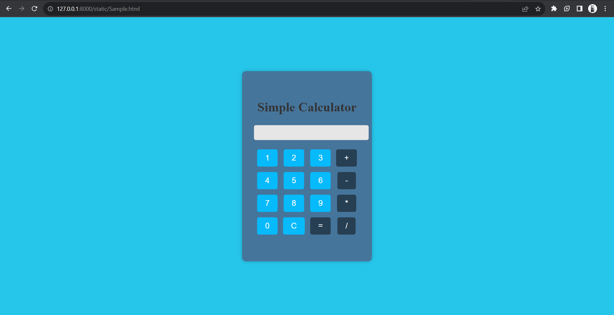

# Ex.08 Design of a Standard Calculator
## Date:04/11/2023

## AIM:
To design a web application for a standard calculator with minimum five operations.

## DESIGN STEPS:

### Step 1:
Clone the github repository and create Django admin interface.

### Step 2:
Change settings.py file to allow request from all hosts.

### Step 3:
Use CSS for creating attractive colors.

### Step 4:
Write JavaScript program for implementing five different operations.

### Step 5:
Validate the HTML and CSS code.

### Step 6:
Publish the website in the given URL.

## PROGRAM :

```
<!DOCTYPE html>
<html lang="en">
<head>
    <title>Simple Calculator</title>
    <style>
        body {
            display: flex;
            justify-content: center;
            align-items: center;
            height: 100vh;
            margin: 0;
            background-color: #26c6ea;
        }

        #calculator-container {
            background-color: #46759b;
            padding: 50px 30px;
            border-radius: 10px;
            box-shadow: 0 0 10px rgba(0, 0, 0, 0.2);
            text-align: center;
        }

        input[type="text"] {
            width: 100%;
            padding: 10px;
            margin: 5px 0;
            color: #333;
            background-color: #e6e6e6;
            border: 1px solid #ccc;
            border-radius: 5px;
        }

        table {
            margin-top: 10px;
        }

        button {
            padding: 10px 20px;
            font-size: 20px;
            margin: 5px;
            cursor: pointer;
            background-color: #06bafb;
            color: #fff;
            border: none;
            border-radius: 5px;
        }

        button:hover {
            background-color: #5e46a5;
        }

        button.operator {
            background-color: #273f53;
        }

        button.operator:hover {
            background-color: #12365b;
        }

        #error-message {
            color: red;
            font-weight: bold;
            margin-top: 10px;
        }
    </style>
</head>
<body>
    <div id="calculator-container">
        <h1 style="color: #333;">Simple Calculator</h1>
        <input type="text" id="display" readonly>
        <table>
            <tr>
                <td><button onclick="appendToDisplay('1')">1</button></td>
                <td><button onclick="appendToDisplay('2')">2</button></td>
                <td><button onclick="appendToDisplay('3')">3</button></td>
                <td><button onclick="appendToDisplay('+')" class="operator">+</button></td>
            </tr>
            <tr>
                <td><button onclick="appendToDisplay('4')">4</button></td>
                <td><button onclick="appendToDisplay('5')">5</button></td>
                <td><button onclick="appendToDisplay('6')">6</button></td>
                <td><button onclick="appendToDisplay('-')" class="operator">-</button></td>
            </tr>
            <tr>
                <td><button onclick="appendToDisplay('7')">7</button></td>
                <td><button onclick="appendToDisplay('8')">8</button></td>
                <td><button onclick="appendToDisplay('9')">9</button></td>
                <td><button onclick="appendToDisplay('*')" class="operator">*</button></td>
            </tr>
            <tr>
                <td><button onclick="appendToDisplay('0')">0</button></td>
                <td><button onclick="clearDisplay()">C</button></td>
                <td><button onclick="calculateResult()" class="operator">=</button></td>
                <td><button onclick="appendToDisplay('/')" class="operator">/</button></td>
            </tr>
        </table>
        <div id="error-message"></div>
    </div>
    <script>
        function appendToDisplay(value) {
            document.getElementById('display').value += value;
            document.getElementById('error-message').innerText = '';
        }

        function clearDisplay() {
            document.getElementById('display').value = '';
            document.getElementById('error-message').innerText = '';
        }

        function calculateResult() {
            try {
                document.getElementById('display').value = eval(document.getElementById('display').value);
                document.getElementById('error-message').innerText = '';
            } catch (error) {
                document.getElementById('error-message').innerText = 'Error';
            }
        }
    </script>
</body>
</html>
```

## OUTPUT:



## RESULT:
The program for designing a standard calculator using HTML and CSS is executed successfully.
